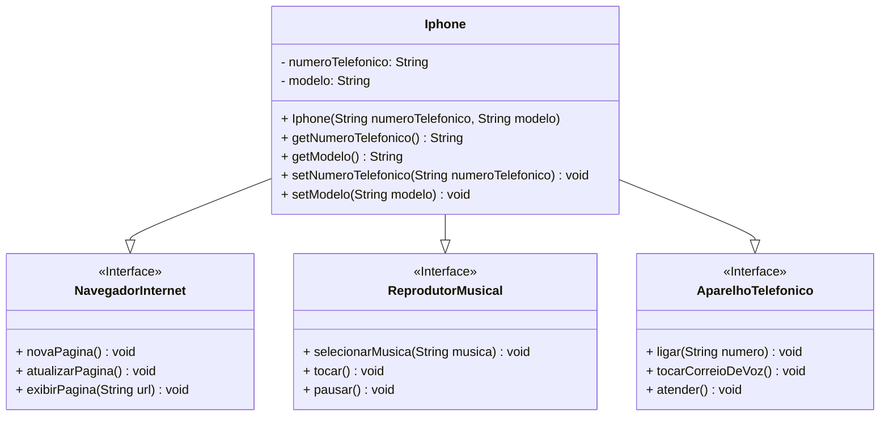

# Projeto: Iphone em Java

Este projeto foi desenvolvido para fins de estudo da linguagem Java, explorando conceitos de orientação a objetos, implementação de interfaces e modelagem de UML.

## Descrição

O código implementa uma classe `Iphone` que simula funcionalidades básicas de um smartphone. A classe implementa três interfaces principais:

- **ReprodutorMusical**: Responsável por ações relacionadas à reprodução de músicas.
- **NavegadorInternet**: Oferece métodos para navegação na web.
- **AparelhoTelefonico**: Permite simular funcionalidades telefônicas.

### Funcionalidades Implementadas

#### **AparelhoTelefonico**
- `ligar(String numero)`: Simula uma ligação para um número especificado.
- `tocarCorreioDeVoz()`: Simula a reprodução do correio de voz.
- `atender()`: Simula o atendimento de uma chamada.

#### **NavegadorInternet**
- `novaPagina()`: Simula a abertura de uma nova página.
- `atualizarPagina()`: Simula a atualização da página atual.
- `exibirPagina(String url)`: Exibe a página especificada pelo URL.

#### **ReprodutorMusical**
- `selecionarMusica(String musica)`: Seleciona uma música para reprodução.
- `tocar()`: Inicia a reprodução da música selecionada.
- `pausar()`: Pausa a música que está tocando.

## Estrutura do Código

A classe `Iphone` possui os seguintes atributos:
- `numeroTelefonico` (String): Número telefônico associado ao dispositivo.
- `modelo` (String): Modelo do dispositivo.

### Construtor
O construtor permite inicializar o objeto com um número telefônico e um modelo:
```java
public Iphone(String numeroTelefonico, String modelo) {
    this.modelo = modelo;
    this.numeroTelefonico = numeroTelefonico;
}
```

### Métodos de Acesso (Getters e Setters)
São fornecidos métodos para acessar e modificar os atributos `numeroTelefonico` e `modelo`.

### Tecnologias Utilizadas
- Linguagem: Java
- Paradigma: Orientação a Objetos

## Objetivo do Projeto
Este projeto foi desenvolvido para praticar:

- Criação e uso de interfaces.
- Implementação de métodos em classes.
- Manipulação de atributos e métodos com encapsulamento.


### Contribuições
Este repositório é destinado a fins de estudo. Contribuições são bem-vindas para melhorar o código ou explorar novos conceitos.

### Licença
Este projeto não possui licença e é destinado apenas para uso educacional.

### Diagrama UML
Abaixo está o diagrama UML que descreve a estrutura do projeto e as relações entre as classes e interfaces:

